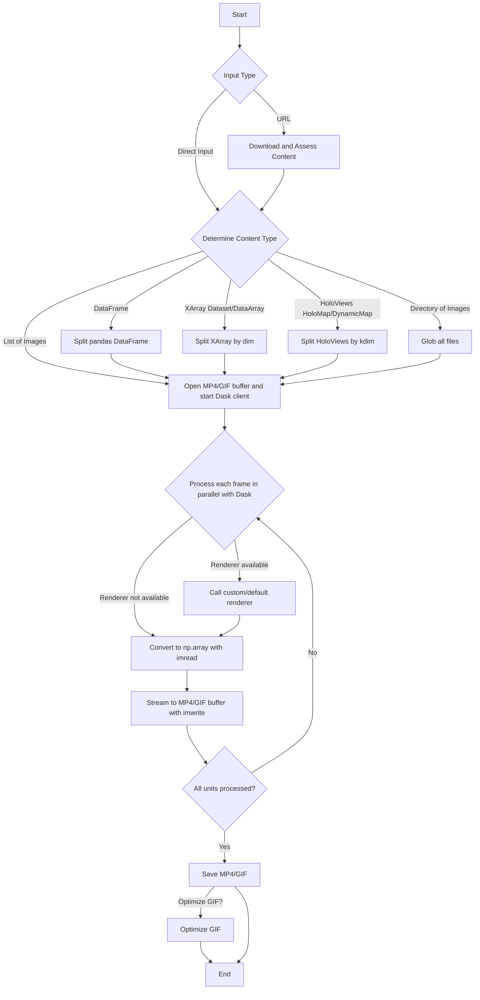

# Package design

## 🪪 Naming

StreamJoy stems from the idea of streaming parallelized, output images to GIF or MP4, *as they get serialized*.

This was a mini breakthrough for me, as I had written other packages to try efficiently animating data (e.g. [`enjoyn`](https://enjoyn.readthedocs.io/en/latest/) and [`ahlive`](https://ahlive.readthedocs.io/en/latest/)). However, both of these packages suffered from the bottleneck of having to wait for all the images to get written out to disk before starting generating the animation.

After, discovering this breakthrough, it brought me joy, and I wanted to share that joy with others by writing a package that reduces the boilerplate and time to work on animations, bringing joy to the user.

Coincidentally, SJ is also my wife's initials, so it was a perfect fit! :D

I also was thinking of naming this `streamio` and `streamit`, but the former was already taken and the latter too close to `streamlit`.

## 📶 Diagram

Below is a diagram of the package design. The animation part is actually quite simple--most of the complexity comes with handling various input types, e.g. URLs, files, and datasets.

<figure>
    
    <figcaption>StreamJoy package design</figcaption>
</figure>

